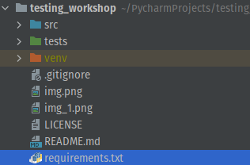

# testing_workshop
Workshop of code testing

## Table of contents:

- [Requirements](#requirements)
- [Test packages for python](#test-packages-for-python)
  - [unittest](#unittest)
  - [pytest](#pytest)
- [Basic concepts](#basic-concepts)
  - [Setup](#setup)
  - [Teardown](#teardown)
  - [Parametrization](#parametrization)
  - [Temporary Files and Directories](#temp)
  - [Asserting Errors](#asserting-errors)
- [Type of tests](#types-of-tests)
  - [Unit tests](#unit-tests)
  - [Integration tests](#integration-tests)
  - [End-to-end tests](#end-to-end-tests)
- [Running tests](#run)
  - [Comand Line Interface](#cmd)
  - [Name Space](#name-space)
- [Mocks](#mocks)
  - [Why using mocks](#why-using-mocks)
  - [How to implement them](#how-to-implement-them)
- [Code coverage](#code-coverage)
- [Profile](#profile)

<a name="requirements"></a>
## Requirements

- unittest (stdlib)
- coverage >= 6.0
- cProfile (stdlib)
- timeit (stdlib)
- tempfile (stdlib)

- pytest >= 7.0
- pytest-cov >= 3.0
- pytest-mock >= 3.7

<a name="test-packages-for-python"></a>
## Test packages for python

<a name="unittest"></a>
### unittest

[Unittest](https://docs.python.org/3/library/unittest.html) is a standard library for python. Its version will depend on your python instalation.

#### Asserting

Asserting whenever the outputs are as expected is done through methods of the testcase, which follow the pattern:

```python
self.assertCONDTION
```

The total list of avaialble asserts is extensive and can be found in the documentation website: [Asserts](https://docs.python.org/3/library/unittest.html#unittest.TestCase.assertEqual)

#### TestCases

The base design of unittest circles around the concept of the testcase. This is an object that should be inherited.

Usually a testcase is centered around a class in the source code, file or family of functions.

```python
import unittest

class DefaultWidgetSizeTestCase(unittest.TestCase):
    def test_default_widget_size(self):
        widget = Widget('The widget')
        self.assertEqual(widget.size(), (50, 50))
```

A useful pattern in developing tests for inherited classes is to create a shared template test case.
For example, when many io methods are implemented, a base testcase canbe tasked with setting up test data through the SetUp() and TearDown() methods.

```python
import unittest
from ABC import ABCMeta
from pathlib import Path
from tests import ROOT_DIR

class BaseIOTestCase(metaclass=ABCMeta):
    def setUp(self) -> None:
        data_folder = Path(ROOT_DIR) / 'data'
        self.csv_path = data_folder / "proteins.csv"
        self.csv_path_write = data_folder / "proteins_written.csv"
        self.faa_path = data_folder / "proteins.faa"
        self.faa_path_write = data_folder / "proteins_written.faa"
        # setup code
    
    def tearDown(self) -> None:
        self.csv_path_write.unlink()
        self.faa_path_write.unlink()
    
    def test_read(self) -> None:
        pass
    
    def test_write(self) -> None:
        pass

class CSVTestCase(BaseIOTestCase, unittest.TestCase):
    def test_read(self) -> None:  
        self.assertTrue(self.csv_path.is_file())
    
    def test_write(self) -> None:
        self.assertFalse(self.csv_path_write.is_file())
        
class FAATestCase(BaseIOTestCase, unittest.TestCase):
    def test_read(self) -> None:
        self.assertTrue(self.faa_path.is_file())
    
    def test_write(self) -> None:
        self.assertFalse(self.faa_path_write.is_file())
```

<a name="pytest"></a>
### pytest

[Pytest](https://docs.pytest.org/en/7.1.x/) is an alternative library, backwards compatible with the unittest syntax as well as adding a new design philosophy to tests.
Tests are more functional, and it makes use of powerful python decorators aswell as a comprehensive plugin library to extend its capabilities.
TestCase-like test layouts can still do employed, however, this test case class doesn't need to inherit from any package class.

To correclty employ this powerful test engine correctly there is a [Good Practices](https://docs.pytest.org/en/6.2.x/goodpractices.html) guide that provides a clear overview of good usage patterns to adress common tasks.

#### Asserting

Pytest follows the older python syntax, of using the ```assert``` keyword.
This method employs traditional python boolean loogic and operators for condition verification.

```python
def inc(x):
    return x + 1

def test_answer():
    assert inc(3) == 5

# test case
class TestCase():
  def inc(x):
      return x + 1
  
  def test_answer():
      assert inc(3) == 5
```

[More about Fixtures](https://docs.pytest.org/en/7.1.x/how-to/fixtures.html), specialy how to do Tear downs and Cleanups.

<a name="basic-concepts"></a>
## Basic Concepts

There are many concepts that are generic and avaialble through the different libraries.

<a name="setup"></a>
### Setup

The setup phase of testing is usualy isolated contains any logic necessary to load, generate or otherwise prepare data, mocks or test cases for the test functions.

Having an isolated setup opens the doors to reusability in similar tests, well as focusing the test functions in the assertion logic.

#### Unittest

Unittest has a reserved method within the testcase class, called setUp(), that can be overwritten.
This method will be automaticaly run whenever a test within the same testcase is run. On the other hand, when multiple tests with a class are run, it will only be run once before any test starts. Saving time and memory.
All data and logic that needs to be available in the test functions should be assinged to a variable belonging to the class, following the ```self.var = data``` pattern.

```python
import unittest

class WidgetTestCase(unittest.TestCase):
    def setUp(self):
        self.widget = Widget('The widget')

    def test_default_widget_size(self):
        self.assertEqual(self.widget.size(), (50,50),
                         'incorrect default size')
```

#### Pytest and its fixtures / decorators

On the other hand most setup work in Pytest is done through fixtures / decorators.

Decorators can be used to register fixture functions whose return can be later used. In the test function, multiple fixtures can be called by name.
Larger scopes can be used, and in a fixture needs to carry many variables, a class scope can be used, with data being accessed similarly to unittest.

```python
# Functional test fixtures
@pytest.fixture
def fruit_bowl():
    return [Fruit("apple"), Fruit("banana")]


def test_fruit_salad(fruit_bowl):
    # Act
    fruit_salad = FruitSalad(*fruit_bowl)

    # Assert
    assert all(fruit.cubed for fruit in fruit_salad.fruit)

# Test classes fixtures, through the use of scope, this can also be made available through whole modules, packages or session
@pytest.fixture(scope='class')
def input(request):
    request.cls.varA = 1
    request.cls.varB = 2
    request.cls.varC = 3
    request.cls.modified_varA = 2

@pytest.mark.usefixtures('input')
class TestClass:
    def test_1(self):
        sum(self.varA, self.varB)

    def test_2(self):
        sum(self.varC, self.modified_varA)
```

<a name="teardown"></a>
### Teardown

The testing libraries also offer clean up strategies, so that any data generated by the setup, that can't be simply released from memory, can be properly disposed of.
The aim is to return the test envrioment to its pre-test state. 

Common examples include closing sessions to remote apis or services and cleaning up written files or builds.

#### Unittest

In unittest, the syntax and design follows that of ```self.setUp()```. The new method is now called ```self.tearDown()```, and is run when all the other tests, within a testcase, have been finished.

```python
import unittest

class WidgetTestCase(unittest.TestCase):
    def setUp(self):
        self.widget = Widget('The widget')

    def tearDown(self):
        self.widget.dispose()
        
    def test_default_widget_size(self):
        self.assertEqual(self.widget.size(), (50,50),
                         'incorrect default size')

```

#### Pytest

Pytest, however, employs a radicaly different strategy. The same fixture used to generate data is also responsible for its cleanup. Fixtures clean after themselves.
The only change need in the fixture code for this to work is the usage of ```yield DATA``` instead of ```return DATA```. Any logic after the yield will be run after the test is completed.

[Pytest Teardown](https://docs.pytest.org/en/latest/how-to/fixtures.html#teardown-cleanup-aka-fixture-finalization)

```python
import pytest

@pytest.fixture()
def resource():
    print("setup")
    yield "resource"
    print("teardown")

class TestResource:
    def test_that_depends_on_resource(self, resource):
        print("testing {}".format(resource))
```

[Stackoverflow Example](https://stackoverflow.com/a/39401087)

<a name="parametrization"></a>
### Parametrization

Parametrization is a method of reusing test logic with as many test conditions as possible, helping validate many edgecases.

#### Unittest

Though there is not an oficial implementation of this method within unittest. By using loops, data can be cycled through an assertion conditon.
The base assertion framework can however prove to be limiting and constraining.

```python
import unittest

class WidgetTestCase(unittest.TestCase):
    def setUp(self):
        self.test_cases = [(22,1), (44,2)]

        
    def test_test_cases(self):
        for case in self.test_cases:
            input, expected = case
            self.assertEqual(input/22, expected)
```

#### Pytest

On the otherhand there is a dedicated framework within pytest for this exact process, where lists of tuples are employed, and can be mapped to many variables.

```python
testdata = [
    (datetime(2001, 12, 12), datetime(2001, 12, 11), timedelta(1)),
    (datetime(2001, 12, 11), datetime(2001, 12, 12), timedelta(-1)),
]

@pytest.mark.parametrize("a,b,expected", testdata)
def test_timedistance_v0(a, b, expected):
    diff = a - b
    assert diff == expected
```

<a name="temp"></a>
### Temporary Files and Directories

Finaly, within python itself, there are useful utilies that might aid us with temporarly storing/writing data. These can be used in conjuction with the setup and teardown methods, or idependently in the body of the test functions.

The [tempfile](https://docs.python.org/3/library/tempfile.html) library allows both the creation of temporary files and temporary directories.
They are usualy generated within our working directory, though this can be changed, and have manageble lifetimes.

```python
import tempfile

# create a temporary file and write some data to it
fp = tempfile.TemporaryFile()
fp.write(b'Hello world!')
# read data from file
fp.seek(0)
fp.read()
# close the file, it will be removed
fp.close()

# create a temporary file using a context manager
with tempfile.TemporaryFile() as fp:
    fp.write(b'Hello world!')
    fp.seek(0)
    fp.read()
# file is now closed and removed

# create a temporary directory using the context manager
with tempfile.TemporaryDirectory() as tmpdirname:
  print('created temporary directory', tmpdirname)
# directory and contents have been removed
```

The lifetime of the folders can be managed manualy, by using the ```.closed()``` method, or on the other had by employing a context manager. Recall that the context manager uses the ```with .... as ... :``` syntax.

```python
import unittest
from pathlib import Path
import tempfile

class TestCase(unittest.TestCase):
    def setUp(self):
        self.temp_folder = tempfile.TemporaryDirectory()
        self.working_dir = Path(self.temp_dir.name)


    def tearDown(self):
        self.temp_folder.cleanup()
```

Pytest also has builtin fixtures, that only need to be called for the tempfile library. These temporary folders/files share the lifetime of the test function.

```python
# content of test_tmpdir.py
def test_create_file(tmpdir):
    p = tmpdir.mkdir("sub").join("hello.txt")
    p.write("content")
    assert p.read() == "content"
    assert len(tmpdir.listdir()) == 1
    assert 0
```

[tmpdir pytest fixtures](https://docs.pytest.org/en/6.2.x/tmpdir.html#the-tmpdir-fixture)

<a name="asserting-errors"></a>
### Asserting Errors

It is particulary important to test our erro logic, namly to chek if our error handling is capable of detecting input errors.

#### Unittest

Using unittest there are two paths to detect the that an error has been raised.

You can on one hand use the ```self.assertRaises()``` assertion normaly. 
Though be careful as the first argument is the function you want to test, and the following the *nargs to be passed to it.

Or on the other hand the ```self.assertRaises()``` assertion can be used within a context manager. 
The function that is supposed to raise the error can just be used within this context. 
The manager will catch any exception raised.

With either approach the used should pass the error type, for example ```ZeroDivisionError```, ```TypeError```, among others. 

```python
import unittest


def whatever(i):
    return i/0


class TestWhatEver(unittest.TestCase):
  
    def test_whatever(self):
        with self.assertRaises(ZeroDivisionError):
            whatever(3)

    def test_whatever(self):
        self.assertRaises(ZeroDivisionError, div, 3,0)
```

#### Pytest


Pytest operates simirlarly to the unittest usage of a context mananger. However, an output to the context mananger can be defined and later evaluted on, to test error messages, among other implementation details.
Alternativly to query the error message body, the named argument ```match="pattern"``` can be employed. This will query the error message using Regular Expressions.

```python
def test_raises():
    with pytest.raises(Exception) as exc_info:   
        raise Exception('some info')
    # these assert calls are identical; you can use either one   
    assert exc_info.value.args[0] == 'some info'
    assert str(exc_info.value) == 'some info'

def test_another_raises():
  with pytest.raises(ValueError, match='must be 0 or None'):
      raise ValueError('value must be 0 or None')

def test_the_second_another_raises():
  with pytest.raises(ValueError, match=r'must be \d+$'):
      raise ValueError('value must be 42')
```

[Stackoverflow Discussion](https://stackoverflow.com/questions/23337471/how-to-properly-assert-that-an-exception-gets-raised-in-pytest)

<a name="types-of-tests"></a>
## Type of tests

Tests can be caracterized by their scope. They can test individual functions and methods and other structures, 
can test the interaction of many, or enven full use case scenarios.

The appropriate coverage of the test with different kinds of tests, guarantes that from its small building blocks, to 
larger interoperable blocks and usecases, the expectations regarding inputs and outputs are validated.

<a name="unit-tests"></a>
### Unit tests

- [Example - Testing IO functions](https://github.com/nebi-um/testing_workshop/blob/main/tests/unit_tests/test_io.py)
- [Example - Testing Data Structures](https://github.com/nebi-um/testing_workshop/blob/main/tests/unit_tests/test_data_structures.py)
- [Example - Testing Mocked SeqIO BLAST](https://github.com/nebi-um/testing_workshop/blob/main/tests/unit_tests/test_blast.py)
- [Example - Testing Uniprot API call](https://github.com/nebi-um/testing_workshop/blob/main/tests/unit_tests/test_api.py)

<a name="integration-tests"></a>
### Integration tests

- [Example - Testing a Data Structure Interaction](https://github.com/nebi-um/testing_workshop/blob/main/tests/integration_tests/test_data_structures_blast.py)
- [Example - Testing a IO to Data Structure loading](https://github.com/nebi-um/testing_workshop/blob/main/tests/integration_tests/test_io_data_structures.py)

<a name="end-to-end-tests"></a>
### End-to-end tests

- [Example - Testing a Blast Pipeline](https://github.com/nebi-um/testing_workshop/blob/main/tests/end_to_end_tests/test_blast_pipeline.py)

<a name="run"></a>
## Running tests

The tests can be called within the command line or the IDE.

<a name="cmd"></a>
### Comand Line Interface

Both packages offer simple command lines. Pay careful atention to your working directory when using the auto-discovery features.

```bash
python -m unittest # Uses automatic test discovery
python -m unittest -v test_module # pass a module
python -m unittest tests/test_something.py

pytest # Uses automatic test discovery
pytest -q test_sysexit.py #less verbose output
```

<a name="name-space"></a>
### Name Space

The src code should be available to the interperter, either by adding it to the PYTHONPATH variables, like Pycharm does.



Or by instaling the package within a virtual enviroment. This requires that the package configuration has been done.

```bash
pip install -e .
```

<a name="mocks"></a>
## Mocks

Mocking is a technique used in testing code. The developer creates "fake" data, objects or functions.
Sometimes even patching over existing functions with these representations.

There is tooling for both packages (unittest / pytest), based around the mock library, that is now part of unittest.

- [unittest.mock](https://docs.python.org/3/library/unittest.mock.html)
- [pytest-mock](https://pypi.org/project/pytest-mock/)

<a name="why-using-mocks"></a>
### Why using mocks

Many times it is very useful to mock code, that is outside the scope of our tests, but it is still used by the code being tested.

- When running unit tests, isolating the code being tested from the code it depends on, helps trace the source of errors. 
Otherwise, it can be dificult to determine the source of the error. 

- When depending on computationaly or resource intensive code, like alignment tools or API calls. 

- Mocking can also be used to simplify the test setup, as mocking external libraries or APIs makes tests idependent of access to them, simplyfing the overall setup.
For this last use case, some end to end code tests should at least guarantee that the integration actually works with the true third party library. 
But there is only a need to run it sporadicly, like at Merge time, to increase developement speed.

- Functions in which your code depends, might generate undeterministic results, which make it harder to test. 
You can overcome this by mocking these functions.

<a name="how-to-implement-them"></a>
### How to implement them

The Mock library available within the test libraries have Mock objects.
These are objects whose methods and parameters can be easily declared to return a specific value.
It is also possible to use Mock objects within another Mock object, to make these representations that much detailed.

In adition to the standard Mock object there is also the MagickMock object.
What this object does, is to return the user defined returns, when the mocked methods within are called, or when no return has been declared by the user, atempt to fill it, inpromptly with a legal value for the method.

[MagicMock vs Mock](https://stackoverflow.com/questions/17181687/mock-vs-magicmock)

Finally, mocked objects can provide information about how many times a mocked method has been called, with what arguments, etc. This provides a further level of avaialble assertions.

### Patching

Patching is where the mocked object is used to overwrite the namespace of an existing function.
Example:

 > When running the function that calls an API like urllib.request within the function being tested.
 > The urllib.request interface can be mocked.
 > The fuction being tested will be then interacting with a Mock object, whose returns we can define.

#### unittest

```python
import unittest
from unittest.mock import patch, Mock, MagicMock

from tmp import my_module


class MyClassTestCase(unittest.TestCase):

    def test_create_class_call_method(self):
        # Create a mock to return for MyClass.
        m = MagicMock()
        # Patch my_method's return value.
        m.my_method = Mock(return_value=2)

        # Patch MyClass. Here, we could use autospec=True for more
        # complex classes.
        with patch('tmp.my_module.MyClass', return_value=m) as p:
            value = my_module.create_class_call_method()

        # Method should be called once.
        p.assert_called_once()
        # In the original my_method, we would get a return value of 1.
        # However, if we successfully patched it, we'll get a return
        # value of 2.
        self.assertEqual(value, 2)


if __name__ == '__main__':
    unittest.main()
```

Example from [stackoverflow](https://stackoverflow.com/questions/57044593/python-unittest-mock-class-and-class-method)

#### pytest

```python
import os

class UnixFS:

    @staticmethod
    def rm(filename):
        os.remove(filename)

def test_unix_fs(mocker):
    mocker.patch('os.remove')
    UnixFS.rm('file')
    os.remove.assert_called_once_with('file')
```

<a name="code-coverage"></a>
## Code coverage

[Coverage](https://coverage.readthedocs.io/en/6.4/) is a way of running tests for a whole package, with a tracker that identifies what lines of the codebase are tested or not.

Although developers should aim for high coverage levels. 
There is a balance to be had between the time dedicated creating tests and their usefuless. 
Not everything requires a unique unittest if larger scope tests, like integration offer appropriate coverage.

Generaly these tools provide both an overall coverage percentage, aswell as file level coverage.
Sometimes detailed HTML reports can be produced that will map visualy the coverage within each file for a project.

The coverage python package can run both pytest and unittests. 
There is also a pytest-cov plugin that integrates it into the pytest call.

```bash
coverage run -m unittest test_arg1.py test_arg2.py test_arg3.py

coverage run -m pytest test_arg1.py test_arg2.py test_arg3.py
pytest --cov=src/package tests/
```

```bash
-------------------- coverage: ... ---------------------
Name                 Stmts   Miss  Cover
----------------------------------------
myproj/__init__          2      0   100%
myproj/myproj          257     13    94%
myproj/feature4286      94      7    92%
----------------------------------------
TOTAL                  353     20    94%
```

Pycharm integrates with this tool through the following button. 

<a name="profile"></a>
## Profile

Benchmarking can be a precious tool when tryin to identify bootlenecks.
Like with coverage, you don't need to profile the whole codebase.
As long as the most computationaly intensive parts are well identified, and operate within the desired/necessary specifications.
It can be very valuble in identifying bugs in the code, that lead to simple code being called too freequently, or require long-running times.

### cProfile

This python package, benchmarks functions exectution times, as well as number of calls.

```python
import cProfile
import re
cProfile.run('re.compile("foo|bar")')
```

```bash
      197 function calls (192 primitive calls) in 0.002 seconds

Ordered by: standard name

ncalls  tottime  percall  cumtime  percall filename:lineno(function)
     1    0.000    0.000    0.001    0.001 <string>:1(<module>)
     1    0.000    0.000    0.001    0.001 re.py:212(compile)
     1    0.000    0.000    0.001    0.001 re.py:268(_compile)
     1    0.000    0.000    0.000    0.000 sre_compile.py:172(_compile_charset)
     1    0.000    0.000    0.000    0.000 sre_compile.py:201(_optimize_charset)
     4    0.000    0.000    0.000    0.000 sre_compile.py:25(_identityfunction)
   3/1    0.000    0.000    0.000    0.000 sre_compile.py:33(_compile)
```

```bash
python -m cProfile [-o output_file] [-s sort_order] (-m module | myscript.py)
```

This tool can also be used within Pycharm, with the 
button.

### timeit

This is another python package that time acuratly the runtime for a script, even running it multiple times to produce average run times.
For time measuring purpouses, it is superior to cProfile, as it has little computational overhead.

```bash
python -m timeit [-n N] [-r N] [-u U] [-s S] [-h] [statement ...]
```

## Moving into CI/CD

If you are interested to move even further into the paradigm of using tests as part of your development activities, then you should
look into some futher topics:

- CI/CD pipelines: 
  - CircleCI
  - Gitlab
  - Jenkins
  - GitHub Actions
- Linting
  - flake8
- Type Checker
  - mypy
- Isolated Environments  
  - tox
- Local code CD
  - pre-commit
- Virtual Enviroments
  - venv
- Packaging
  - setuptools (setup.cfg based packages is the most modern approach)

Interested, but confused?

There will be a new workshop covering these topics in the future!